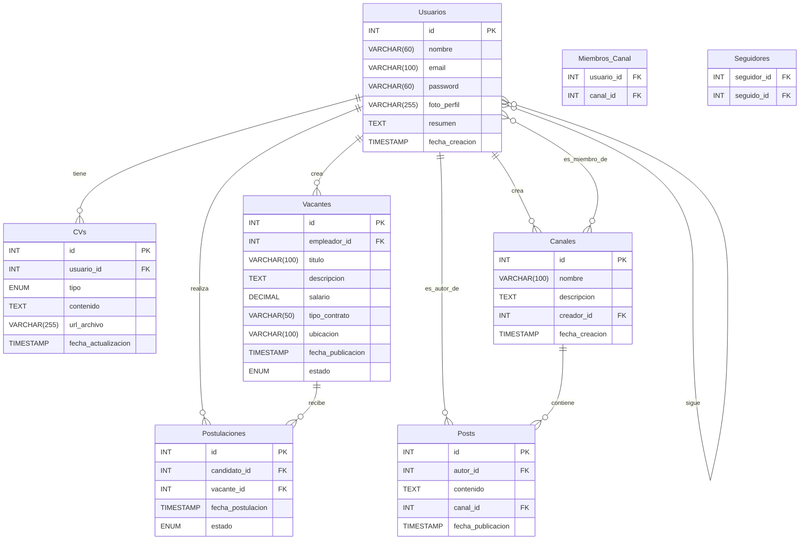

# Diseño de la Base de Datos: DevJobs

## 1. Esquema de Base de Datos Relacional

A continuación, se detalla el diseño de las tablas para la base de datos de DevJobs.

### Tabla: `Usuarios`
Almacena la información de los usuarios registrados.
- `id` (PK, INT, AUTO_INCREMENT)
- `nombre` (VARCHAR(60))
- `email` (VARCHAR(100), UNIQUE)
- `password` (VARCHAR(60))
- `foto_perfil` (VARCHAR(255), NULLABLE)
- `resumen` (TEXT, NULLABLE)
- `fecha_creacion` (TIMESTAMP, DEFAULT CURRENT_TIMESTAMP)

### Tabla: `CVs`
Almacena la información de las hojas de vida, ya sea en archivo o generada.
- `id` (PK, INT, AUTO_INCREMENT)
- `usuario_id` (FK, INT, references `Usuarios(id)`)
- `tipo` (ENUM('archivo', 'generado'))
- `contenido` (TEXT, NULLABLE) - Para el CV generado en formato JSON.
- `url_archivo` (VARCHAR(255), NULLABLE) - Para el CV subido.
- `fecha_actualizacion` (TIMESTAMP)

### Tabla: `Vacantes`
Contiene la información de las ofertas de empleo.
- `id` (PK, INT, AUTO_INCREMENT)
- `empleador_id` (FK, INT, references `Usuarios(id)`)
- `titulo` (VARCHAR(100))
- `descripcion` (TEXT)
- `salario` (DECIMAL(10, 2), NULLABLE)
- `tipo_contrato` (VARCHAR(50))
- `ubicacion` (VARCHAR(100))
- `fecha_publicacion` (TIMESTAMP, DEFAULT CURRENT_TIMESTAMP)
- `estado` (ENUM('abierta', 'cerrada'), DEFAULT 'abierta')

### Tabla: `Postulaciones`
Tabla intermedia para la relación muchos a muchos entre `Usuarios` y `Vacantes`.
- `id` (PK, INT, AUTO_INCREMENT)
- `candidato_id` (FK, INT, references `Usuarios(id)`)
- `vacante_id` (FK, INT, references `Vacantes(id)`)
- `fecha_postulacion` (TIMESTAMP, DEFAULT CURRENT_TIMESTAMP)
- `estado` (ENUM('pendiente', 'aceptado', 'rechazado'), DEFAULT 'pendiente')

### Tabla: `Canales`
Almacena los canales temáticos creados por los usuarios.
- `id` (PK, INT, AUTO_INCREMENT)
- `nombre` (VARCHAR(100), UNIQUE)
- `descripcion` (TEXT, NULLABLE)
- `creador_id` (FK, INT, references `Usuarios(id)`)
- `fecha_creacion` (TIMESTAMP, DEFAULT CURRENT_TIMESTAMP)

### Tabla: `Miembros_Canal`
Relaciona a los usuarios con los canales a los que se unen.
- `usuario_id` (FK, INT, references `Usuarios(id)`)
- `canal_id` (FK, INT, references `Canales(id)`)
- PRIMARY KEY (`usuario_id`, `canal_id`)

### Tabla: `Posts`
Contiene los posts creados por los usuarios.
- `id` (PK, INT, AUTO_INCREMENT)
- `autor_id` (FK, INT, references `Usuarios(id)`)
- `contenido` (TEXT)
- `canal_id` (FK, INT, references `Canales(id)`, NULLABLE) - Si el post pertenece a un canal.
- `fecha_publicacion` (TIMESTAMP, DEFAULT CURRENT_TIMESTAMP)

### Tabla: `Seguidores`
Relaciona a los usuarios que se siguen entre sí.
- `seguidor_id` (FK, INT, references `Usuarios(id)`)
- `seguido_id` (FK, INT, references `Usuarios(id)`)
- PRIMARY KEY (`seguidor_id`, `seguido_id`)

## 2. Diagrama Entidad-Relación (ERD)

